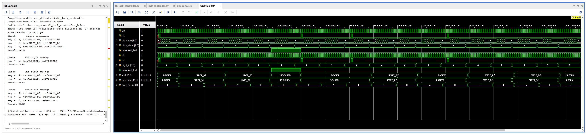
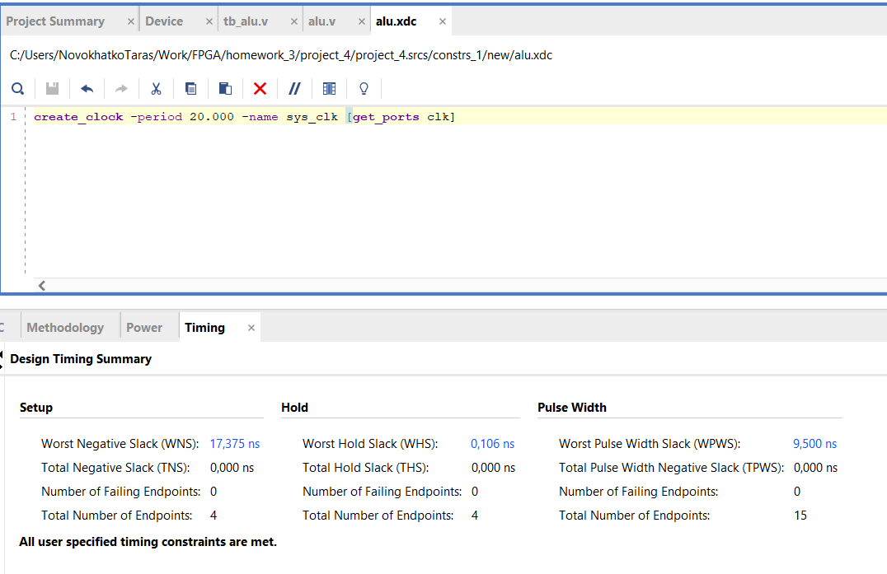
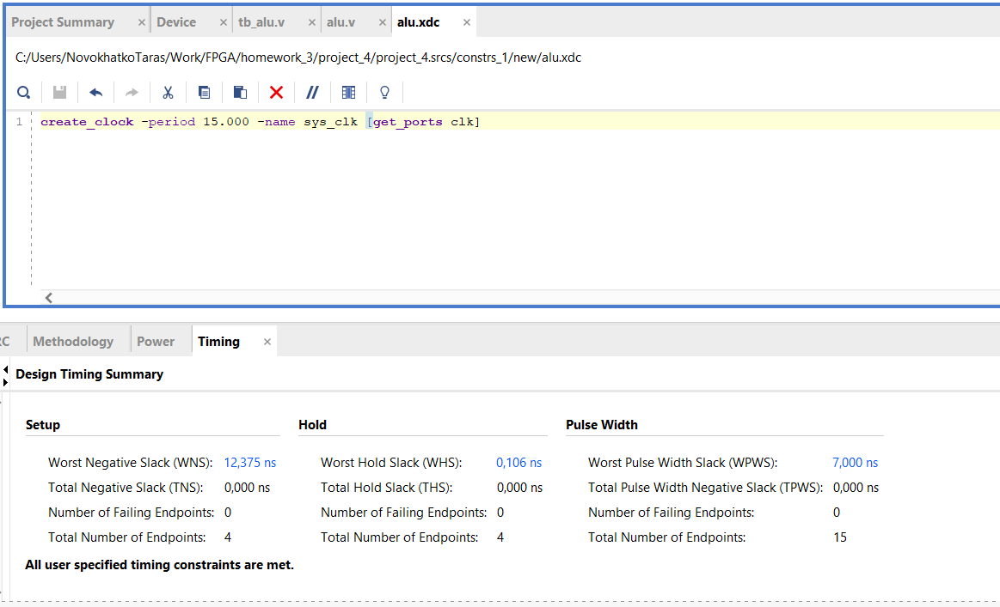
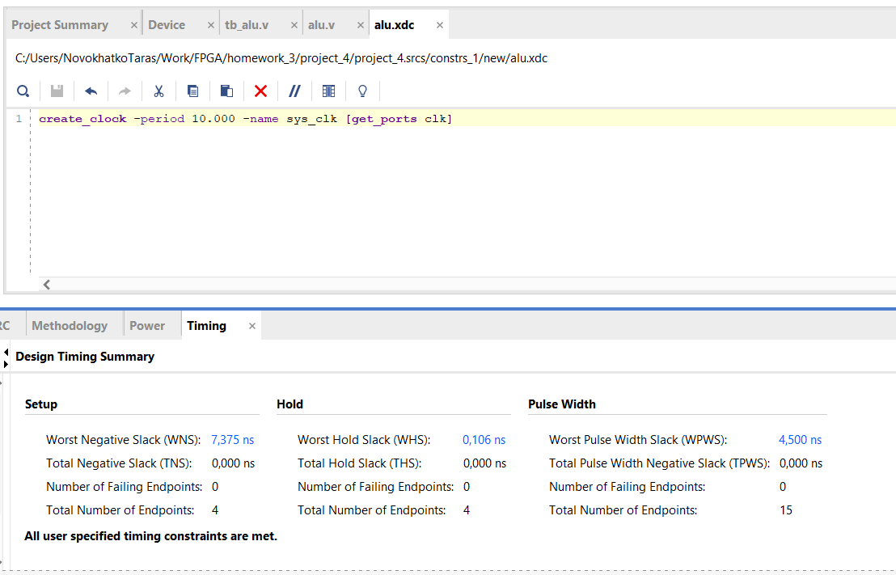
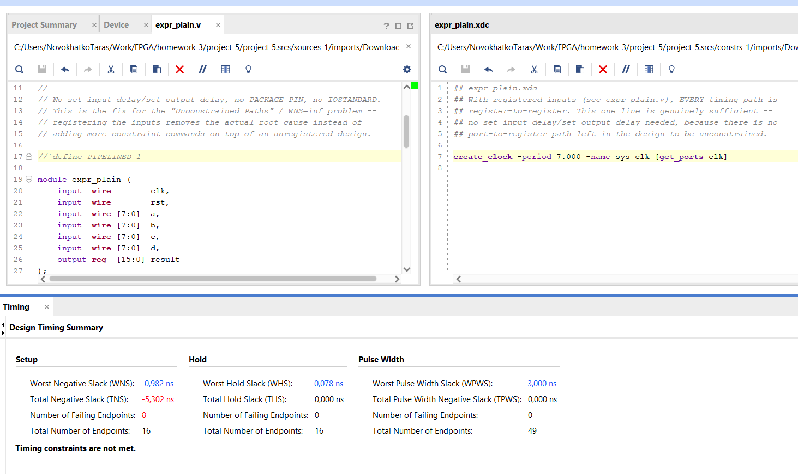
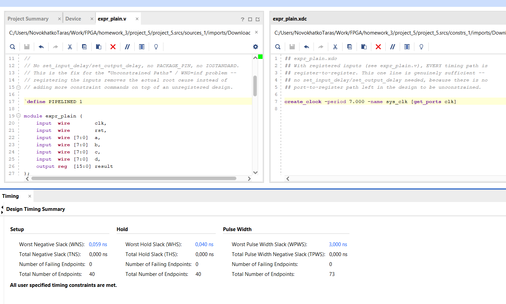

# 1. Lock Controller

## Reproduction Steps

- Open [project_3.xpr](project_3/project_3.xpr) with Vivado
- Set `tb_lock_controller` as top simulation source
- Run behavioral simulation
- Check the Tcl Console for the results

## Results

## Description

- In order to make `lock_controller` and `debounce` modules work together the following assumption was accepted: case `digit_in` == 0 corresponds to released buttons state and is not a valid key combination. Otherwise `lock_controller` module will be forced to change its state on duplications of button press event, as far as `debounce` module holds the value of pressed button for `COUNT_MAX` cycles.
- The project contains four source files:
    - [lock_controller.sv](project_3/project_3.srcs/sources_1/new/lock_controller.sv) - main controller code
    - [lock_controller_pkg.sv](project_3/project_3.srcs/sources_1/new/lock_controller_pkg.sv) - SystemVerilog package with the FSM states enumeration shared between design and testbench
    - [debounce.sv](project_3/project_3.srcs/sources_1/new/debounce.sv) - debounce counter module to eliminate physical button jitter
    - [tb_lock_controller.sv](project_3/project_3.srcs/sim_1/new/tb_lock_controller.sv) - testbench for controller
- The main controller contains three `always` blocks for the lock controller finite-state machine (FSM):
    - The state-register block updates the current state and handles the asynchronous reset.
    - The next-state logic block calculates state transitions from the current state and input digit, accounting assumption that `digit_in` == 0 stands for released buttons state.
    - The output logic block assigns `unlocked_led` based on the current state.
- The testbench generates the clock, instantiates the lock controller as the device under test (DUT), instantiates the debounce filters, and checks several input sequences.
- The `check_states` task resets the DUT and iterates over the input digits. Each iteration simulates button press event by changing `digit_raw` to 0 and to current input value for `BTN_BOUNCE` times (2x `BTN_BOUNCE` cycles), then holds the input stable for the same period of time. The task compares the DUT's current state with the expected state and reports the result for each sequence. After comparison release button event is simulated in the similar to press event way, with the only difference that steady state part holds 0 instead of valid value. 
- The testbench invokes the task four times:
    - A correct sequence that ends in the `UNLOCKED` state
    - An incorrect first digit that leaves the controller in the `LOCKED` state
    - An incorrect second digit after a correct first digit
    - An incorrect third digit after two correct digits

# 2. TIMING SUMMARY REPORT

## Reproduction Steps

- Open [project_4.xpr](project_4/project_4.xpr) with Vivado
- Open [alu.xdc](project_4/project_4.srcs/constrs_1/new/alu.xdc) file and set clock period to 20, 15 and 10 ns subsequently
- Run implementation for each of clock values to generate the timing reports

## Results

## Description

As shown in the screenshots, WNS decreases with increasing clock frequency (i.e., with decreasing clock period).

# 3. PIPELINING

## Reproduction Steps

- Open [project_5.xpr](project_5/project_5.xpr) with Vivado
- Check that file [expr_plain.v](project_5/project_5.srcs/sources_1/imports/Downloads/expr_plain.v) contain line 17 commented out (`PIPELINED` definition)
- Check that constraits file exist [expr_plain.xdc](project_5/project_5.srcs/constrs_1/imports/Downloads/expr_plain.xdc) and contain 7ns clock period (this value was measured for the deliberately selected build target: xc7z020clg400-1)
- Run implementation and ensure that current version doesn't meet timing requirements
- Uncomment line 17 in [expr_plain.v](project_5/project_5.srcs/sources_1/imports/Downloads/expr_plain.v) file
- Do not touch constraits file
- Run implementation again and ensure that current version successfully meets timing requirements

## Results
Before

After

## Description

This project contains plain and pipelined versions of the same expression. The `PIPELINED` definition selects between the two versions. The timing results can be compared to demonstrate how adding a pipeline stage affects the maximum operating frequency and WNS.
