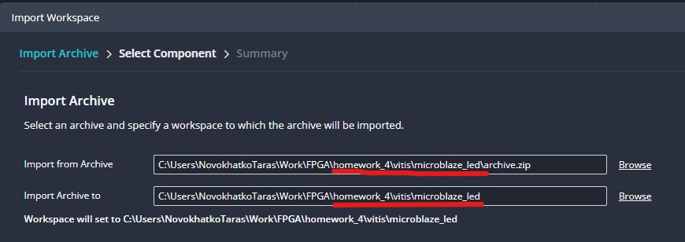
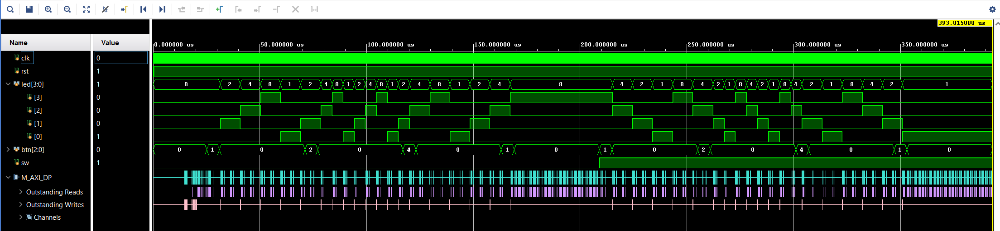

# 1. MicroBlaze project

## Reproduction Steps

- Open Vitis IDE and import (File -> Import) [archive.zip](vitis/microblaze_led/archive.zip) into the same folder
    
- Run `app_component` build, make sure it passed successfully ([app_component.elf](vitis/microblaze_led/app_component/build/app_component.elf) file is generated) 
- Open [microblaze_led.xpr](vivado/microblaze_led/microblaze_led.xpr) with Vivado
- Make sure it passes implementation successfully (I experienced issues with different versions for some IPs when tried to run the project on another workstation, fixed it with updating some IPs from block design)
- Run behavioral simulation
- Add `tb_led_mb/dut/design_1_i/microblaze_0/M_AXI_DP` to the waveform to get simulation results depicted below

## Results

## Description

- System contains 4 LED outputs, 3 Buttons (`Start/Stop`, `Speed Up`, `Slow Down`), 1 Switch (direction)
- Testbench consists of simple testing procedure called twice for different directions (Switch On/Off)
- Procedure simulates 4 buttons activation: `Start`, `Speed Up`, `Slow Down`, `Stop`
- Before first button event all LEDs are off (all zeroes)
- First `Start/Stop` button activates increasing order of LEDs (2,4,8,1,2 and so on)
- `Speed Up` button keeps the same order, but LEDs outputs are switching 2 times faster
- `Slow Down` button reverts back initial speed
- Second `Start/Stop` button activation stops LEDs (sets all LED outputs to zeroes) 
- Same procedure is repeated for Switch == 1 state with the only one difference: decreasing order of the LED outputs (4,2,1,8,4)
- Both testbench simulation and `app_component` source timings were picked to make simulation faster. Production code should account this, as far as real timings will be much longer.

# 2. Zynq project

## Description
- Project has the similar reproduction steps but without simulation part.
- Unfortunately I have no possibility to check it on hardware :(

# 3. Projects Path and Source files 

There are 4 subfolders:
- [vivado/microblaze_led](vivado/microblaze_led) - Vivado part for MicroBlaze project
- [vivado/zynq_led](vivado/zynq_led) - Vivado part for Zynq project
- [vitis/microblaze_led](vivado/microblaze_led) - Vitis part for MicroBlaze project
- [vitis/zynq_led](vivado/zynq_led) - Vitis part for Zynq project

List of handwritten source files:
- [main.c](vitis/main.c) - PS (Vitis) source file (same for both Microblaze and Zynq projects)
- [led_mb.xdc](vivado/microblaze_led/microblaze_led.srcs/constrs_1/imports/FPGA_courses/led_mb.xdc) - PL (Vivado) constraits file for MicroBlaze project
- [zynq_led.xdc](vivado/zynq_led/zynq_led.srcs/constrs_1/new/zynq_led.xdc) - PL (Vivado) constraits file for Zynq project
- [tb_led_mb.sv](vivado/microblaze_led/microblaze_led.srcs/sim_1/imports/FPGA_courses/tb_led_mb.sv) - PL (Vivado) testbench file for MicroBlaze project

All other files were generated by Vivado/Vitis IDEs