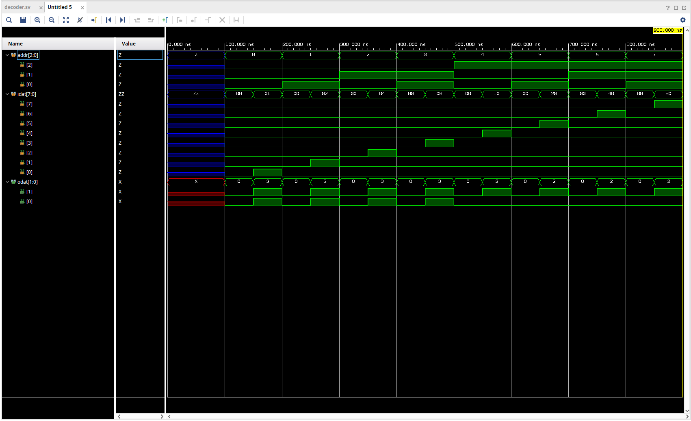
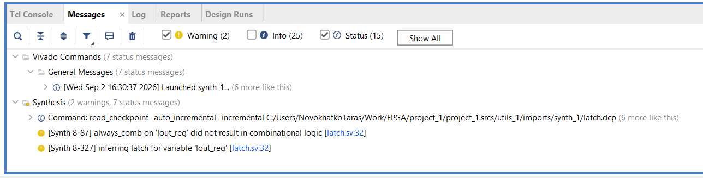
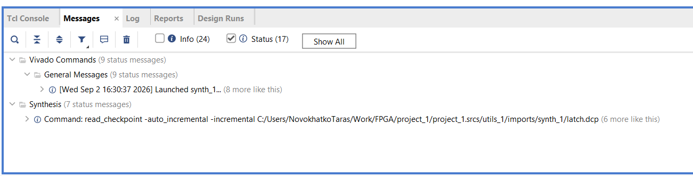

# Decoder task

## Steps to reproduce:

- Open project_1.xpr with Vivado
- Set decoder_wrapper as top simulation source
- Run behavioral simulation
- Restart simulation
- Run Tcl script [decoder.tcl](project_1.srcs/sources_1/new/decoder.tcl)
- Run whole simulation

## Results:

## Explanation:

- `addr` steps through the eight values from `0` to `7` at 100 ns intervals.
- At the midpoint of each interval, `idat` becomes one-hot: bit `addr` is set and all other bits are cleared. It is cleared again when `addr` changes.
- `odat[0]` is produced by the 4-bit `dec4` instance. It selects `idat[addr[1:0]]`, so it is high for addresses `0` through `3` after their corresponding bit is set. For addresses `4` through `7`, `idat[3:0]` is clear, so it remains low.
- `odat[1]` is produced by the 8-bit `dec8` instance. It selects `idat[addr]` and is high for each address after the corresponding one-hot `idat` bit is set.

# Latch task

## Steps to reproduce:

- Open project_1.xpr with Vivado
- Set `latch` as top design source
- Run synthesis
- Observe warnings 

- Uncomment line 22 of [latch.sv](project_1.srcs/sources_1/new/latch.sv) file 
- Rerun synthesis
- Observe clean report

## Explanation

- Lines 31-36 of [latch.sv](project_1.srcs/sources_1/new/latch.sv) file contain `if` statement with preprocessor definition `FIX_LATCH`.
- Mentioned before preprocessor definition is disabled by default at line 22 of the source, which makes `lout` value undefined in case if `linp0` is 0. Synthesis warns about inferring latch. 
- `else` part is activated when line 22 is uncommented. This makes `lout` value defined in all cases. Synthesis warning is cleared.