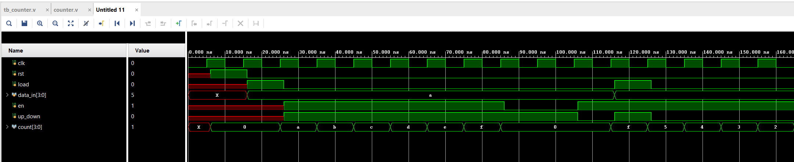
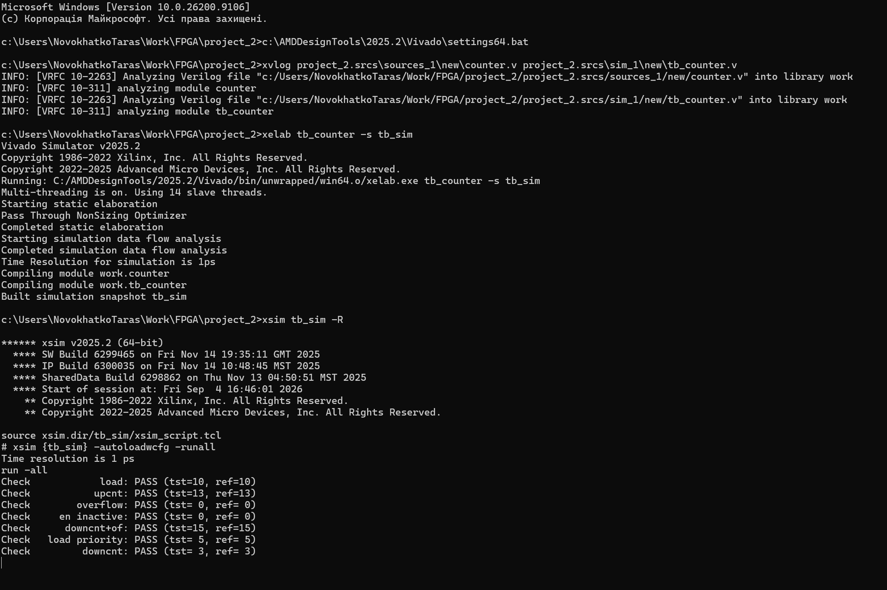

# Verification and testbench
## Description

Counter implementation source: [counter.v](project_2.srcs/sources_1/new/counter.v)

Counter inplementation has the following inputs and outputs:
- input `clk` - clock
- input `rst` - reset (1 - active)
- input `load` - load counter 
- input `data_in` - data to load (4-bit)
- input `en` - enable counter
- input `up_down` - count direction (1 - up; 0 - down)
- output `count` - counted value (4-bit)

Priority of signals:

- `rst` - set `count` to 0 with highest priority
- `load` - load `data_in` value if `rst` is not active 
- `en` - count up/down based on `up_down` if `rst` and `load` are not active
- if all 3 mentioned above signals are inactive `count` should not be changed

Testbench source: [tb_counter.v](project_2.srcs/sim_1/new/tb_counter.v)

Testbench covers 7 test cases:
- testing `load` signal impact on counter
- counting up (en=1 up_down=1)
- counting up with counter overflow (`en`=1, `up_down`=1, `count`=15 before last posedge `clk`)
- disabling `en` input
- counting down with overflow (`en`=1, `up_down`=0, `count`=0 before last posedge `clk`)
- `load` signal priority (both `load` and `en` are active)
- counting down without overflow (`en`=1, `up_down`=0, `count`!=0 before last posedge `clk`)

Waveform of the simulation looks as at picture below:



`count` signal is in `x` state at the start of the simulation, because it was not initialized somehow and no driving signal (`rst`,`load`) arrived at a moment.

## Console run

1. Open command line at project destination (`project_2` folder) 

2. execute tools enviroment script:
```console
c:\AMDDesignTools\2025.2\Vivado\settings64.bat
```

3. Run compilation, elaboration and simulation:
```console
xvlog project_2.srcs\sources_1\new\counter.v project_2.srcs\sim_1\new\tb_counter.v
```
```console
xelab tb_counter -s tb_sim
```
```console
xsim tb_sim -R
```

4. Results are shown on picture below:


