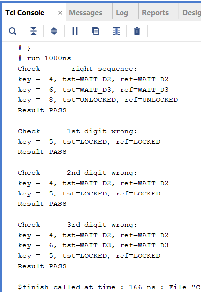

# Lock Controller

## Steps to reproduce

- Open `project_3.xpr` with Vivado
- Set `tb_lock_controller` as top simulation source
- Run behavioral simulation
- check `tcl console` for results

## Results:

## Explanation:
- Project contain 3 source files:
    - [lock_controller.sv](project_3/project_3.srcs/sources_1/new/lock_controller.sv) - main controller code
    - [lock_controller.vh](project_3/project_3.srcs/sources_1/new/lock_controller.vh) - header file with states enumeration to share between design and testbench
    - [tb_lock_controller.sv](project_3/project_3.srcs/sim_1/new/tb_lock_controller.sv) - testbench for controller
- Main code file contain 3 `always` blocks for lock controller finite state machine (FSM):
    - sync block: reset or set next state of FSM
    - states logic block: describes conditions for state changes
    - output logic block: assings output based on current state of FSM
- Testbench is written to easily check numerous combinations of input sequences. Task `check_states` resets device under test (DUT) and iterates over all input values for `digit_in` of DUT. Each iteration compares current DUT state with corresponding expected state for current `digit_in` value and displays current and expected values of `digit_in` and `state`. Each comparison sets `total_res` variable to 0 in case of failure. Aggregated comparison result based on final `total_res` value is displayed at the end of each task call. Testbench calls task 4 times:
    - "good" combination - when final state is `UNLOCKED` 
    - 1st button press failure - button pressed once, final state is `LOCKED`
    - 2nd button press failure - button pressed 2 times, one intermedite state is "good", final state is `LOCKED`
    - 3rd button press failure - button pressed 3 times, two intermediete states are "good", final state is `LOCKED`
